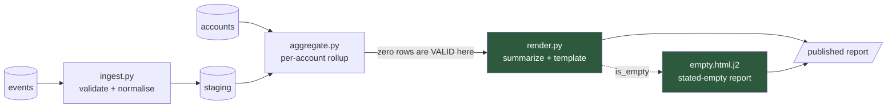

# Example — Architecture (fictional, for structure only)

Part of one worked example shared across this library: **Meterstream**, an imaginary internal
pipeline that ingests usage events and publishes daily summary reports. Copy the *structure*,
never the content.

The `../Discussions/...` and `../References/...` links below point into a project's own `Notes/`
tree, not into this library — **they do not resolve here, deliberately.** They are showing how a
real architecture document cites its companions. Do not go looking for those files.

---

```yaml
---
# --- required ---
id: "2026-03-06-reporting-pipeline-dataflow"
schema_version: 1
type: "architecture"
title: "Reporting pipeline — data flow"
summary: "How events reach a published summary, and where the empty-result decision is enforced."
date: "2026-03-06"
status: "active"
initiative: "Phase 2"
companion_docs:
  - "2026-03-04-empty-report-handling"
supersedes: null
superseded_by: null
ref: "main@a41c9f2"
diagram_type: "dataflow"

# --- optional: only the ones with a real value are here ---
created_at: "2026-03-06T11:00:00+00:00"
updated_at: "2026-03-06T11:00:00+00:00"
review_by: "2026-06-01"
generator: "notes-architecture / claude-opus-5"
source: { type: "repository", location: "pipeline/" }
repo: "meterstream"
paths: ["pipeline/"]
project: "Meterstream"
domain: "Reporting"
team: "Data Platform"
owner: "Dana"
tags: ["reporting", "dataflow"]
---
```

# Reporting pipeline — data flow

**Scope:** how a usage event becomes a published daily summary, as of `main@a41c9f2`.



Green marks where the empty-result decision is enforced.

## Components

| Component | Responsibility | Inputs → Outputs | Notes |
|---|---|---|---|
| `ingest.py` | Validate and normalise raw events | `events` → `staging` | Rejects rather than coerces malformed rows |
| `aggregate.py` | Per-account rollup over the reporting window | `staging` + `accounts` → in-memory frame | **A zero-row result is valid and must stay valid** |
| `render.py` | Turn a frame into a published report | frame → report | Owns the empty-state branch; the only component that knows a human reads the output |

## Rationale

The empty check lives at the render boundary rather than in `aggregate.py` because an empty
aggregate is a legitimate result — guarding there would make every future caller inherit a
decision that only the rendering step has the context to make. Recorded in
[empty-report-handling](../Discussions/empty-report-handling.md).

Window boundaries are per-account timezone, inherited from the legacy job — see
[legacy-summary-job](../References/legacy-summary-job.md).
A UTC rewrite would silently shift every historical total.

## Open considerations

- `ingest.py` and `aggregate.py` both hardcode the `staging` table name; they will drift silently
  if it is ever renamed.
- `review_by` is set because this diagram reflects one commit. It is wrong the moment the render
  path changes.
